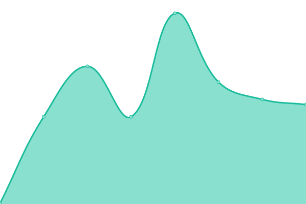

## [📈 Live Status](https://demo.upptime.js.org): <!--live status--> **🟧 Partial outage**

This repository contains the open-source uptime monitor and status page for [Zettatel](https://zettatel.com), powered by [Upptime](https://github.com/upptime/upptime).

Upptime is used by [**1,000+**](https://github.com/topics/upptime) people and teams to ensure they know when their endpoints go down.

<!--end: description-->

<!--start: status pages-->
<!-- This summary is generated by Upptime (https://github.com/upptime/upptime) -->
<!-- Do not edit this manually, your changes will be overwritten -->
<!-- prettier-ignore -->
| URL | Status | History | Response Time | Uptime |
| --- | ------ | ------- | ------------- | ------ |
|  [Zettatel API](https://www.google.com) | 🟩 Up | [google.yml](https://github.com/upptime/upptime/commits/HEAD/history/google.yml) | 

 64ms
     
 | 

<a href="https://demo.upptime.js.org/history/google">100.00%</a>
    

|  [Zettatel Website](https://en.wikipedia.org) | 🟩 Up | [wikipedia.yml](https://github.com/upptime/upptime/commits/HEAD/history/wikipedia.yml) | 

 232ms
     
 | 

<a href="https://demo.upptime.js.org/history/wikipedia">100.00%</a>
    

|  [Zettatel Documentation](https://news.ycombinator.com) | 🟩 Up | [hacker-news.yml](https://github.com/upptime/upptime/commits/HEAD/history/hacker-news.yml) | 

 353ms
     
 | 

<a href="https://demo.upptime.js.org/history/hacker-news">0.00%</a>
    

<!--end: status pages-->
[**Visit our status website →**](https://status.zettatel.com)

## 📄 License

- Powered by: [Upptime](https://github.com/upptime/upptime)
- Code: [MIT](./LICENSE) © [Zettatel](https://zettatel.com)
- Data in the `./history` directory: [Open Database License](https://opendatacommons.org/licenses/odbl/1-0/)
