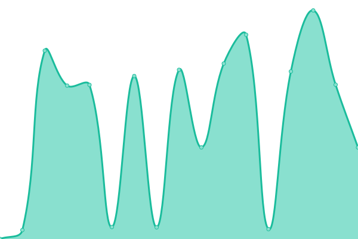

This repository contains the open-source uptime monitor and status page for [Zettatel](https://zettatel.com), powered by [Upptime](https://github.com/upptime/upptime).

<!--end: description-->

With [Upptime](https://upptime.js.org), you can get your own unlimited and free uptime monitor and status page, powered entirely by a GitHub repository. We use [Issues](https://github.com/zettatel/status/issues) as incident reports, [Actions](https://github.com/zettatel/status/actions) as uptime monitors, and [Pages](https://status.zettatel.com) for the status page.

<!--start: status pages-->
<!-- This summary is generated by Upptime (https://github.com/upptime/upptime) -->
<!-- Do not edit this manually, your changes will be overwritten -->
<!-- prettier-ignore -->
| URL | Status | History | Response Time | Uptime |
| --- | ------ | ------- | ------------- | ------ |
|  [Zettatel API](https://portal.zettatel.com/SMSApi) | 🟥 Down | [zettatel-api.yml](https://github.com/Zettatel/status/commits/HEAD/history/zettatel-api.yml) | 

 0ms
     
 | 

<a href="https://status.zettatel.com/history/zettatel-api">0.00%</a>
    

|  [Zettatel Website](https://zettatel.com) | 🟩 Up | [zettatel-website.yml](https://github.com/Zettatel/status/commits/HEAD/history/zettatel-website.yml) | 

 2392ms
     
 | 

<a href="https://status.zettatel.com/history/zettatel-website">100.00%</a>
    

|  [Zettatel Documentation](https://portal.zettatel.com/docs/api/?codeType=sample&apiType=rest&action=overview) | 🟩 Up | [zettatel-documentation.yml](https://github.com/Zettatel/status/commits/HEAD/history/zettatel-documentation.yml) | 

 442ms
     
 | 

<a href="https://status.zettatel.com/history/zettatel-documentation">100.00%</a>
    

<!--end: status pages-->

[**Visit our status website →**](https://status.zettatel.com)

## 📄 License

- Powered by: [Upptime](https://github.com/upptime/upptime)
- Code: [MIT](./LICENSE) © [Zettatel](https://zettatel.com)
- Data in the `./history` directory: [Open Database License](https://opendatacommons.org/licenses/odbl/1-0/)
